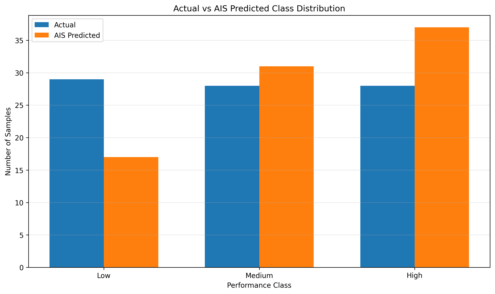

# AI-Based Coal Mine Production Analysis and Performance Classification

## Overview

Coal mining is an important component of the energy and industrial sector, and analyzing mine-level production data can help identify production patterns and differences in operational performance.

This project presents an **AI-Based Coal Mine Production Analysis and Performance Classification System** designed to analyze coal mine production data and classify mines into different production-performance categories.

The project performs data preprocessing, exploratory analysis, feature preparation, production-based performance classification, machine learning model development, and performance evaluation.

A **Random Forest Classifier** is used as the primary machine learning model. In addition, an **Artificial Immune System (AIS)** based optimization technique is implemented using a **Clonal Selection Algorithm** to search for improved Random Forest hyperparameters.

The production performance of coal mines is classified into three categories:

- **Low Production Performance**
- **Medium Production Performance**
- **High Production Performance**

The project also includes a **Particle Swarm Optimization (PSO)** implementation for additional model optimization and experimental comparison.

---

## Project Objective

The main objective of this project is to develop a machine learning system capable of analyzing coal mine production information and classifying mines according to their production performance.

The major objectives are:

1. Load and preprocess coal mine production data.
2. Handle missing, inconsistent, and categorical information.
3. Identify relevant mine, company, and production-related attributes.
4. Analyze the statistical distribution of coal production.
5. Create production-performance classes using production quantiles.
6. Train a machine learning model for performance classification.
7. Optimize Random Forest hyperparameters using Artificial Immune System techniques.
8. Evaluate the classification performance using multiple metrics.
9. Generate predictions for unseen test records.
10. Compare actual and predicted production-performance classes.
11. Generate CSV reports and graphical visualizations.
12. Store trained models and project configuration for future use.
13. Experiment with Particle Swarm Optimization as an additional optimization approach.

---

## Dataset

The dataset used in this project is:

```text
rs_session-241_au482_1.1.csv
```

The original dataset path used during development is:

```text
C:\Users\sagni\Downloads\AI-Based Coal Mine Production Analysis and Performance Classification\rs_session-241_au482_1.1.csv
```

The dataset contains information related to coal mines and their production.

Depending on the original dataset structure, relevant information may include:

- Mine name
- Coal company
- Production quantity
- Subsidiary or organizational information
- Region-related information
- Other mine-level production attributes

The program automatically attempts to identify the most relevant columns from the dataset.

---

## Problem Statement

Coal mines can have substantially different production levels. Manually examining a large number of mine records makes it difficult to identify production-performance patterns efficiently.

The problem addressed by this project is therefore formulated as a **multiclass classification problem**.

Given information associated with a coal mine, the system attempts to classify its production performance into one of three categories:

```text
Low
Medium
High
```

The classes are generated using the distribution of coal production values.

---

## Target Variable

A new target variable is created:

```text
Production_Performance
```

The target contains three classes:

| Class Code | Performance Class |
|---|---|
| 0 | Low |
| 1 | Medium |
| 2 | High |

The numerical production column itself is **not included as an input feature after being used to construct the target**, because doing so would create target leakage.

---

## Performance Classification

The coal production values are divided into approximately three groups using quantile-based classification.

The first threshold corresponds approximately to the **33rd percentile**, while the second corresponds approximately to the **66th percentile**.

Conceptually:

```text
                Coal Production
                       |
          +------------+------------+
          |            |            |
         Low         Medium        High
          |            |            |
       Bottom        Middle         Upper
        ~33%          ~33%          ~33%
```

This approach helps create relatively balanced classes for machine learning.

---

## Project Workflow

The complete project workflow is:

```text
Coal Mine Dataset
        |
        v
Data Loading
        |
        v
Column Cleaning
        |
        v
Missing Value Handling
        |
        v
Production Value Cleaning
        |
        v
Production Statistical Analysis
        |
        v
Performance Class Generation
        |
        v
Feature Selection
        |
        v
Categorical Encoding
        |
        v
Train/Test Split
        |
        v
Baseline Random Forest
        |
        +----------------------------+
        |                            |
        v                            v
   AIS Optimization             PSO Optimization
        |                            |
        v                            v
Optimized Random Forest      Optimized Random Forest
        |                            |
        +-------------+--------------+
                      |
                      v
                Model Evaluation
                      |
                      v
               Result Generation
                      |
                      v
          CSV + Graphs + Model Files
```

---

## Data Preprocessing

Before model training, several preprocessing operations are performed.

### 1. Dataset Loading

The program attempts to load the CSV dataset using multiple encodings:

```text
UTF-8
UTF-8-SIG
CP1252
Latin-1
```

This improves compatibility with datasets containing different text encodings.

### 2. Column Name Cleaning

Column names are cleaned by:

- Removing unnecessary line breaks
- Removing carriage-return characters
- Replacing repeated spaces
- Removing leading and trailing spaces

Duplicate column names are also automatically renamed.

### 3. Empty Data Removal

Rows and columns containing only missing values are removed.

### 4. Production Data Cleaning

Production values are converted into numeric format.

The preprocessing procedure removes unnecessary characters such as:

```text
,
₹
spaces
other non-numeric characters
```

Invalid production values are converted into missing values and removed before further analysis.

### 5. Categorical Data Cleaning

Categorical columns such as mine and company names are standardized.

Missing categorical values are replaced with:

```text
Unknown
```

### 6. Duplicate Feature Handling

Duplicate feature columns are removed before model training.

---

## Feature Engineering

The project automatically identifies useful categorical attributes such as:

```text
Mine Name
Coal Company
Subsidiary
Region
```

depending on the available columns in the dataset.

Categorical features are transformed using:

```text
OneHotEncoder
```

with:

```python
handle_unknown="ignore"
```

This allows the trained model to handle categories in test data that may not have appeared during training.

---

## Avoiding Target Leakage

An important design consideration in this project is the prevention of **target leakage**.

The production quantity is used to generate the production-performance class.

For example:

```text
Production Quantity
        |
        v
Low / Medium / High
```

Therefore, directly providing production quantity to the classifier would make the prediction problem trivial and produce misleadingly high accuracy.

For this reason:

```text
Production quantity -> Used to create target
Production quantity -> Excluded from model input features
```

This provides a more meaningful evaluation of the classification model.

---

# Machine Learning Model

## Random Forest Classifier

The primary machine learning algorithm used in this project is:

```text
Random Forest Classifier
```

Random Forest is an ensemble machine learning algorithm that combines predictions from multiple decision trees.

Conceptually:

```text
                 Input Data
                     |
       +-------------+-------------+
       |             |             |
       v             v             v
    Tree 1        Tree 2        Tree 3
       |             |             |
       +-------------+-------------+
                     |
                     v
               Majority Voting
                     |
                     v
            Performance Class
```

Random Forest is suitable for this project because it:

- Handles nonlinear relationships.
- Works effectively for classification problems.
- Can model complex interactions between features.
- Is relatively resistant to overfitting compared with a single decision tree.
- Supports multiclass classification.
- Can be combined effectively with optimization algorithms.

---

# Artificial Immune System Optimization

## What is AIS?

**Artificial Immune System (AIS)** refers to computational optimization methods inspired by biological immune systems.

Biological immune systems recognize foreign substances, generate antibodies, clone effective antibodies, and preserve useful immune memory.

AIS algorithms adapt these ideas to computational optimization.

In this project, a **Clonal Selection Algorithm** is used to optimize Random Forest hyperparameters.

---

## AIS Representation

Each antibody represents a possible Random Forest configuration.

An antibody contains:

```text
n_estimators
max_depth
min_samples_split
min_samples_leaf
max_features
```

For example:

```text
Antibody
   |
   +-- n_estimators = 300
   |
   +-- max_depth = 15
   |
   +-- min_samples_split = 4
   |
   +-- min_samples_leaf = 2
   |
   +-- max_features = sqrt
```

Each antibody therefore represents one possible machine learning model configuration.

---

## AIS Fitness Function

Each antibody is evaluated using cross-validation.

The fitness function is based on:

```text
Mean Cross-Validation Accuracy
```

Conceptually:

```text
Antibody
   |
   v
Random Forest Parameters
   |
   v
Cross-Validation
   |
   v
Classification Accuracy
   |
   v
Antibody Fitness
```

Higher cross-validation accuracy indicates a better antibody.

---

## AIS Clonal Selection Process

The optimization process follows these general stages:

### Step 1: Population Initialization

A population of random antibodies is created.

### Step 2: Fitness Evaluation

Each antibody is evaluated using cross-validation accuracy.

### Step 3: Selection

The best-performing antibodies are selected.

### Step 4: Cloning

High-performing antibodies are cloned.

Better antibodies can produce more candidate solutions.

### Step 5: Hypermutation

The cloned antibodies are mutated to explore nearby model configurations.

### Step 6: Memory Selection

High-quality antibodies are retained for the next generation.

### Step 7: Diversity Introduction

New random antibodies are introduced to prevent the search from becoming too concentrated around one region.

### Step 8: Repeat

The process continues for multiple generations.

```text
Initial Antibodies
        |
        v
Fitness Evaluation
        |
        v
Select Best Antibodies
        |
        v
Cloning
        |
        v
Hypermutation
        |
        v
Evaluate Clones
        |
        v
Memory Selection
        |
        v
Introduce New Antibodies
        |
        v
Next Generation
```

---

# Particle Swarm Optimization

The project also contains an implementation based on **Particle Swarm Optimization (PSO)**.

PSO is a population-based optimization algorithm inspired by collective behavior such as bird flocking and fish schooling.

Each particle represents a Random Forest configuration.

The particle contains:

```text
n_estimators
max_depth
min_samples_split
min_samples_leaf
max_features
```

Particles move through the search space according to:

- Their current velocity
- Their own best previous position
- The globally best position discovered by the swarm

The general update process can be represented as:

```text
Current Particle
       |
       +---- Personal Best
       |
       +---- Global Best
       |
       v
Velocity Update
       |
       v
Position Update
       |
       v
New Random Forest Parameters
       |
       v
Cross-Validation Evaluation
```

PSO provides an additional optimization experiment that can be compared with the baseline and AIS approaches.

---

# Train-Test Split

The dataset is divided into:

```text
80% Training Data
20% Testing Data
```

A stratified split is used so that the Low, Medium, and High production classes remain approximately proportionally represented in both datasets.

The random state is fixed to:

```python
RANDOM_STATE = 42
```

This helps make experiments reproducible.

---

# Cross-Validation

Cross-validation is used during hyperparameter optimization.

The project uses stratified cross-validation so that class proportions are preserved across folds.

The optimization process evaluates candidate configurations using:

```text
Mean Cross-Validation Accuracy
```

The test set remains separate from the optimization process and is used for final model evaluation.

---

# Evaluation Metrics

The models are evaluated using several classification metrics.

## Accuracy

Accuracy represents the proportion of correctly classified samples.

```text
Accuracy = Correct Predictions / Total Predictions
```

---

## Precision

Precision measures how many samples predicted as belonging to a class actually belong to that class.

```text
Precision = TP / (TP + FP)
```

---

## Recall

Recall measures how many actual samples belonging to a class were successfully identified.

```text
Recall = TP / (TP + FN)
```

---

## F1 Score

F1 Score combines precision and recall.

```text
F1 = 2 × (Precision × Recall) / (Precision + Recall)
```

Weighted precision, recall, and F1 score are used to account for the multiclass nature of the problem.

---

# Confusion Matrix

A confusion matrix is generated to examine how the classifier performs for individual classes.

The matrix follows the general structure:

| Actual / Predicted | Low | Medium | High |
|---|---:|---:|---:|
| Low | Correct Low | Low → Medium | Low → High |
| Medium | Medium → Low | Correct Medium | Medium → High |
| High | High → Low | High → Medium | Correct High |

Values on the main diagonal represent correct predictions.

Values outside the diagonal represent classification errors.

---

# Main Visualization

The primary visualization used for this project is:

```text
ais_class_distribution_graph.png
```



The graph compares the distribution of:

- Actual production-performance classes
- AIS-predicted production-performance classes

for:

```text
Low
Medium
High
```

---

## Interpretation of the Class Distribution Graph

The `ais_class_distribution_graph.png` visualization helps determine whether the AIS-optimized model reproduces the overall class distribution observed in the test dataset.

For each performance category, two quantities are compared:

```text
Actual Number of Samples
AIS Predicted Number of Samples
```

If the predicted class counts are close to the actual counts, the classifier is reproducing the overall test-set distribution reasonably well.

However, the class-distribution graph should not be interpreted as a complete measure of classification accuracy.

Two models can produce similar overall class counts while making different predictions for individual records.

Therefore, this graph should be interpreted together with:

- Accuracy
- Precision
- Recall
- F1 Score
- Confusion Matrix
- Individual prediction results

---

# Additional AIS Visualizations

The AIS implementation generates several additional visualizations.

## AIS Accuracy Graph

```text
ais_accuracy_graph.png
```

Shows the cross-validation and test accuracy associated with the AIS-optimized model.

---

## AIS Prediction Graph

```text
ais_prediction_graph.png
```

Compares actual and predicted performance classes for test samples.

---

## AIS Result Graph

```text
ais_result_graph.png
```

Displays:

```text
Accuracy
Precision
Recall
F1 Score
```

for the AIS-optimized model.

---

## AIS Comparison Graph

```text
ais_comparison_graph.png
```

Compares the baseline Random Forest model with the AIS-optimized Random Forest using multiple evaluation metrics.

---

## AIS Confusion Matrix Heatmap

```text
ais_heatmap.png
```

Provides a visual representation of correctly and incorrectly classified Low, Medium, and High performance records.

---

## AIS Optimization Graph

```text
ais_optimization_graph.png
```

Shows how the optimization process changes across AIS generations.

It can include:

```text
Generation Best Fitness
Generation Average Fitness
Global Best Fitness
```

This helps visualize whether the AIS optimization process is converging.

---

# PSO Visualizations

The PSO experiment produces corresponding visualizations with the `pso_` prefix.

Examples include:

```text
pso_accuracy_graph.png
pso_prediction_graph.png
pso_result_graph.png
pso_comparison_graph.png
pso_heatmap.png
pso_optimization_graph.png
pso_class_distribution_graph.png
```

These outputs can be used to analyze the PSO-optimized model separately from the AIS experiment.

---

# Generated AIS Files

The AIS implementation generates the following files:

```text
ais_model.pkl
ais_config.yaml
ais_metadata.json
ais_processed_data.csv
ais_prediction.csv
ais_result.csv
ais_optimization_history.csv
ais_accuracy_graph.png
ais_prediction_graph.png
ais_result_graph.png
ais_comparison_graph.png
ais_heatmap.png
ais_optimization_graph.png
ais_class_distribution_graph.png
```

---

# Generated PSO Files

The PSO implementation generates:

```text
pso_model.pkl
pso_config.yaml
pso_metadata.json
pso_processed_data.csv
pso_prediction.csv
pso_result.csv
pso_optimization_history.csv
pso_accuracy_graph.png
pso_prediction_graph.png
pso_result_graph.png
pso_comparison_graph.png
pso_heatmap.png
pso_optimization_graph.png
pso_class_distribution_graph.png
```

---

# Output File Description

| File | Description |
|---|---|
| `ais_model.pkl` | Trained AIS-optimized machine learning pipeline |
| `ais_config.yaml` | AIS project configuration and model settings |
| `ais_metadata.json` | AIS model metadata and evaluation information |
| `ais_processed_data.csv` | Cleaned and processed coal mine dataset |
| `ais_prediction.csv` | Actual and predicted classes for test records |
| `ais_result.csv` | AIS model performance metrics |
| `ais_optimization_history.csv` | AIS optimization results by generation |
| `ais_accuracy_graph.png` | AIS accuracy visualization |
| `ais_prediction_graph.png` | Actual vs predicted class visualization |
| `ais_result_graph.png` | Accuracy, precision, recall, and F1 visualization |
| `ais_comparison_graph.png` | Baseline vs AIS model comparison |
| `ais_heatmap.png` | AIS confusion matrix |
| `ais_optimization_graph.png` | AIS optimization progress |
| `ais_class_distribution_graph.png` | Actual vs AIS-predicted class distribution |

---

# Prediction CSV

The AIS prediction file is:

```text
ais_prediction.csv
```

It contains information such as:

```text
Actual_Class_Code
Actual_Class
AIS_Prediction_Code
AIS_Prediction
AIS_Correct
AIS_Probability_Low
AIS_Probability_Medium
AIS_Probability_High
```

An example structure is:

| Actual Class | AIS Prediction | Correct |
|---|---|---|
| Low | Low | True |
| Medium | Medium | True |
| High | Medium | False |
| High | High | True |

This allows individual predictions to be examined rather than relying only on aggregate metrics.

---

# Result CSV

The main AIS result file is:

```text
ais_result.csv
```

It stores metrics including:

```text
AIS Cross-Validation Accuracy
Test Accuracy
Precision
Recall
F1 Score
```

It also stores the optimized Random Forest parameters selected by AIS.

---

# Optimization History

The file:

```text
ais_optimization_history.csv
```

records how the AIS search changes across generations.

Information may include:

```text
Generation
Best Fitness
Average Fitness
Global Best Fitness
Best n_estimators
Best max_depth
Best min_samples_split
Best min_samples_leaf
Best max_features
```

This is useful for studying the optimization process rather than only examining the final model.

---

# Model Storage

The trained AIS-optimized model is saved as:

```text
ais_model.pkl
```

Because the preprocessing pipeline and Random Forest model are stored together, the same preprocessing transformations can be reused when performing future predictions.

The model can be loaded using:

```python
import pickle

with open("ais_model.pkl", "rb") as file:
    model = pickle.load(file)
```

---

# Configuration Storage

The project configuration is stored in:

```text
ais_config.yaml
```

The YAML file contains information such as:

- Dataset configuration
- Feature columns
- Target classes
- Production thresholds
- AIS settings
- Best Random Forest parameters
- Model evaluation metrics

---

# Metadata Storage

Detailed model metadata is stored in:

```text
ais_metadata.json
```

This can include:

- Project name
- Number of records
- Selected features
- Optimization algorithm
- Best AIS antibody
- Cross-validation accuracy
- Test metrics
- Baseline metrics
- Confusion matrix
- Classification report

---

# Project Directory Structure

A typical project directory after running all experiments may look like:

```text
AI-Based Coal Mine Production Analysis and Performance Classification/
│
├── rs_session-241_au482_1.1.csv
│
├── ais_model.pkl
├── ais_config.yaml
├── ais_metadata.json
├── ais_processed_data.csv
├── ais_prediction.csv
├── ais_result.csv
├── ais_optimization_history.csv
│
├── ais_accuracy_graph.png
├── ais_prediction_graph.png
├── ais_result_graph.png
├── ais_comparison_graph.png
├── ais_heatmap.png
├── ais_optimization_graph.png
├── ais_class_distribution_graph.png
│
├── pso_model.pkl
├── pso_config.yaml
├── pso_metadata.json
├── pso_processed_data.csv
├── pso_prediction.csv
├── pso_result.csv
├── pso_optimization_history.csv
│
├── pso_accuracy_graph.png
├── pso_prediction_graph.png
├── pso_result_graph.png
├── pso_comparison_graph.png
├── pso_heatmap.png
├── pso_optimization_graph.png
├── pso_class_distribution_graph.png
│
└── README.md
```

---

# Technologies Used

The project is developed using:

```text
Python
Pandas
NumPy
Scikit-learn
Matplotlib
PyYAML
Pickle
JSON
```

---

# Python Libraries

The major Python libraries can be installed using:

```bash
pip install pandas numpy scikit-learn matplotlib pyyaml
```

---

# System Requirements

Recommended environment:

```text
Python 3.9+
Jupyter Notebook / JupyterLab
VS Code
PyCharm
Windows / Linux / macOS
```

The project was designed to work with standard Python machine learning libraries and does not require a GPU.

---

# How to Run the Project

## Step 1: Install Required Libraries

```bash
pip install pandas numpy scikit-learn matplotlib pyyaml
```

## Step 2: Place the Dataset in the Project Directory

The expected dataset is:

```text
rs_session-241_au482_1.1.csv
```

## Step 3: Configure the Dataset Path

For the original development environment:

```python
PROJECT_DIR = (
    r"C:\Users\sagni\Downloads"
    r"\AI-Based Coal Mine Production Analysis and Performance Classification"
)
```

## Step 4: Run the Base Analysis

Execute the main preprocessing and classification code.

## Step 5: Run AIS Optimization

Execute the AIS implementation to generate all files beginning with:

```text
ais_
```

## Step 6: Run PSO Optimization

Execute the PSO implementation to generate all files beginning with:

```text
pso_
```

## Step 7: Examine the Results

Important outputs include:

```text
ais_result.csv
ais_prediction.csv
ais_class_distribution_graph.png
ais_heatmap.png
ais_comparison_graph.png
ais_optimization_graph.png
```

---

# Model Comparison

The project supports comparison between:

```text
Baseline Random Forest
        |
        +----------------------+
        |                      |
        v                      v
AIS-Optimized RF       PSO-Optimized RF
```

The comparison can be performed using:

- Accuracy
- Precision
- Recall
- F1 Score
- Confusion matrix
- Cross-validation performance
- Optimization convergence

Optimization should be evaluated using validation performance and final held-out test results rather than assuming that an optimized configuration must always outperform the baseline on every metric.

---

# Key Advantages

The project provides several advantages:

- Automated coal mine production analysis
- Production-performance classification
- Automatic categorical feature handling
- Target-leakage prevention
- Multiclass machine learning
- AIS-based hyperparameter optimization
- PSO-based hyperparameter optimization
- Cross-validation-based optimization
- Model persistence
- Prediction CSV generation
- Performance visualization
- Optimization-history tracking
- Reproducible machine learning workflow

---

# Applications

The system can be useful for analytical applications such as:

### Coal Mine Performance Analysis

Classifying mines according to relative production performance.

### Production Pattern Analysis

Studying how mine-level production is distributed across the dataset.

### Comparative Analysis

Comparing production-performance patterns across mines or organizational groups.

### Machine Learning Research

Testing different classification and optimization approaches on coal production data.

### Optimization Research

Comparing bio-inspired optimization methods such as:

```text
Artificial Immune System
Particle Swarm Optimization
```

### Decision-Support Research

Providing structured analytical outputs that can supplement domain-expert review.

---

# Limitations

The project has several important limitations.

### Dataset Dependence

The quality of the results depends heavily on the completeness, correctness, and representativeness of the source dataset.

### Relative Performance Classes

The Low, Medium, and High classes are created using quantiles from the available production data.

Therefore, these classes represent **relative categories within this dataset**, not universal industry performance standards.

### Limited Features

If only mine names, company names, and similar categorical variables are available, the classifier has limited information for explaining real production performance.

More meaningful operational variables could improve the model.

### Historical Data

The model learns patterns from the supplied dataset and does not automatically account for future operational, geological, economic, regulatory, or technological changes.

### Optimization Cost

AIS and PSO evaluate many Random Forest configurations using cross-validation and can therefore require significantly more computation than training one baseline model.

---

# Future Improvements

The project can be extended in several ways.

## 1. Add Operational Features

Future datasets could include:

```text
Workforce
Mine capacity
Mine type
Equipment availability
Operating hours
Geological characteristics
Transportation infrastructure
Energy consumption
Production cost
Safety indicators
```

---

## 2. Production Regression

Instead of only predicting Low, Medium, and High classes, future versions could predict the numerical production quantity directly.

Possible regression algorithms include:

```text
Random Forest Regressor
Gradient Boosting
XGBoost
LightGBM
Artificial Neural Networks
```

---

## 3. Time-Series Forecasting

If production data is available across multiple years or months, the project could be extended to forecast future coal production.

Possible methods include:

```text
ARIMA
SARIMA
LSTM
GRU
Temporal Neural Networks
```

---

## 4. Feature Selection

AIS or PSO could also be adapted for feature-selection tasks.

Each candidate solution could represent a subset of available features, allowing the optimization algorithm to search for a combination that improves predictive performance while reducing model complexity.

---

## 5. Explainable AI

Explainability techniques could be incorporated using:

```text
Feature Importance
Permutation Importance
SHAP
Partial Dependence Analysis
```

These methods could help explain why the model produces a particular classification.

---

## 6. Web Application

The trained model could be deployed through:

```text
Flask
FastAPI
Streamlit
Django
```

A user could enter mine information and receive a predicted performance category.

---

## 7. Interactive Dashboard

An analytical dashboard could display:

```text
Production statistics
Mine distributions
Performance categories
Prediction results
Confusion matrices
Optimization progress
Company-wise analysis
```

Tools such as Streamlit or Plotly Dash could be used.

---

# Research Significance

This project demonstrates how machine learning and bio-inspired optimization can be combined for structured production-data analysis.

The project combines:

```text
Data Preprocessing
        +
Performance Classification
        +
Random Forest
        +
Artificial Immune System
        +
Particle Swarm Optimization
        +
Model Evaluation
        +
Data Visualization
```

AIS and PSO are used as **optimization techniques**, while Random Forest performs the final classification task.

This distinction is important because the optimization algorithms search for model configurations rather than directly replacing the classifier.

---

# Conclusion

The **AI-Based Coal Mine Production Analysis and Performance Classification** project provides an end-to-end machine learning workflow for analyzing coal production records and classifying mines into Low, Medium, and High production-performance categories.

The project performs dataset cleaning, production-value preprocessing, target generation, categorical feature encoding, model training, cross-validation, prediction, and performance evaluation.

A Random Forest Classifier provides the core classification model, while an **Artificial Immune System based Clonal Selection Algorithm** is used to search for improved hyperparameter configurations. A separate **Particle Swarm Optimization** implementation provides an additional bio-inspired optimization experiment.

The primary visualization:

```text
ais_class_distribution_graph.png
```

compares the actual and AIS-predicted distributions of Low, Medium, and High production-performance classes.

Together with the confusion matrix, prediction CSV, evaluation metrics, comparison graph, and optimization history, the project provides a reproducible framework for experimenting with machine learning and optimization methods on coal mine production data.

---

## Main Visualization


---

# Keywords

```text
Coal Mine Production
Coal Production Analysis
Machine Learning
Artificial Intelligence
Performance Classification
Random Forest
Artificial Immune System
AIS
Clonal Selection Algorithm
Particle Swarm Optimization
PSO
Hyperparameter Optimization
Data Analysis
Classification
Production Analytics
Scikit-learn
Python
```
